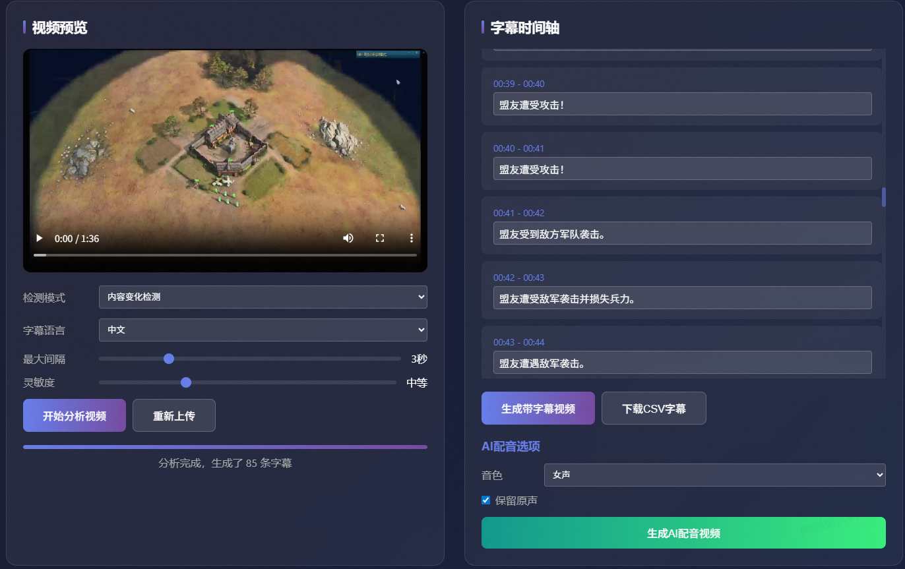

# CyanCaptioner: A MMLM based Video Captioning Agent

<p align="left">
  
</p>

---

## 📖 Introduction / 简介

**CyanCaptioner** (青鸾引) 是一款基于多模态大模型 (MMLM) 开发的智能视频字幕生成代理。我们致力于利用前沿的 AI 技术，为视频内容提供高精度、具备上下文感知能力的自动化字幕解决方案。

**CyanCaptioner** is an intelligent video captioning agent powered by Multi-modal Large Language Models (MMLM). We aim to provide high-precision, context-aware automated subtitling solutions for video content creators.

---

## 🖼️ Demo / 演示展示


> *Caption: Automatic visual understanding and subtitle generation in action.*

---

## ✨ Key Features / 核心特性

* **MMLM Powered**: 深度集成最新多模态大模型，精准识别视频场景与对话。
* **High Robustness**: 具备极强的鲁棒性，能够处理各种复杂背景音与视觉环境。
* **Agent-based Workflow**: 采用 Agent 架构，支持自适应的字幕修正与优化。
* **Easy Integration**: 提供简洁的 API 接口，方便集成进现有的视频处理管线。

---

## 🚀 Quick Start / 快速开始

### Installation

```bash
git clone [https://github.com/YourTeamName/CyanCaptioner.git](https://github.com/YourTeamName/CyanCaptioner.git)
cd CyanCaptioner
pip install -r requirements.txt